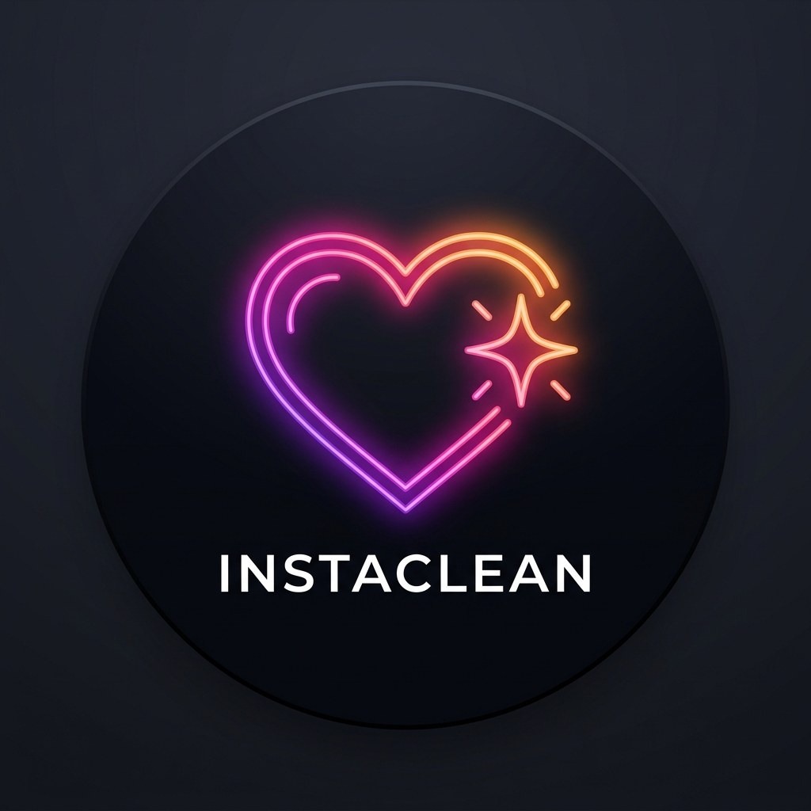

<div align="center">



# ⚡ InstaClean

### The Privacy-First Instagram Mass Unlike Automation Tool

Erase your digital footprint. Bulk unlike thousands of Instagram reels and posts safely with zero data retention, full client-side privacy, and intelligent rate limiting.

[](https://nextjs.org/)
[](https://www.typescriptlang.org/)
[](https://tailwindcss.com/)
[](LICENSE)
[](https://vercel.com/new/clone?repository-url=https%3A%2F%2Fgithub.com%2Fabulhasan-18%2Finstaclean)

<br/>

[Key Features](#-key-features) • [Quick Start](#-quick-start) • [Privacy Architecture](#-zero-storage-privacy-guarantee) • [Meta Export Guide](#-how-to-export-your-instagram-data) • [Cookie Guide](#-how-to-retrieve-your-session-cookies)

</div>

---

## 🚀 1-Click Cloud Deployment

Deploy your own private instance on **Vercel** with one click:

[](https://vercel.com/new/clone?repository-url=https%3A%2F%2Fgithub.com%2Fabulhasan-18%2Finstaclean)

---

## 🌟 Key Features

- 💔 **Bulk Unlike Posts & Reels**: Process thousands of liked items automatically from your official Instagram JSON data download (`liked_posts.json`).
- 🛡️ **Zero-Storage Privacy**: All files and session tokens remain strictly inside your browser's local RAM and `localStorage`. No database, no cloud storage, no data sharing.
- ⚡ **Vercel & Serverless Ready**: Uses client-driven queue orchestration. Requests execute individually in `<400ms`, completely immune to serverless function timeout limits.
- ⏱️ **Intelligent Anti-Ban Rate Limiting**: Randomized delays (5–15s), automatic cooldown pauses (e.g. 5–10 min breaks every X items), and exponential retry backoff.
- 🔑 **Session Cookie Authentication**: Connect instantly using standard `sessionid` & `csrftoken` cookies. Bypasses 2FA, SMS checkpoints, and automated password challenges.
- 💻 **Dual Interface**:
  - **Modern Web Dashboard**: Real-time progress bar, search/filter table, ETA calculations, and terminal-style live streaming logs.
  - **Interactive Terminal CLI**: Fully featured Python CLI utility for terminal power users.

---

## 🛡️ Zero-Storage Privacy Guarantee

InstaClean is engineered from the ground up to guarantee user data safety, multi-user isolation, and zero tracking:

```
┌─────────────────────────────────────────────────────────────┐
│                    User's Web Browser                       │
│  • liked_posts.json loaded in memory only                   │
│  • Session cookies stored in local localStorage             │
│  • Queue timer & delay logic executed in-tab               │
└──────────────────────────────┬──────────────────────────────┘
                               │ (Stateless Single Request)
                               ▼
┌─────────────────────────────────────────────────────────────┐
│               Stateless Vercel Edge Proxy                   │
│  • NO Database (MongoDB / PostgreSQL / Redis)               │
│  • NO Disk / S3 File Persistence                            │
│  • NO Logging of session tokens or user data                │
│  • Forwards request to Instagram in <400ms                  │
└──────────────────────────────┬──────────────────────────────┘
                               │
                               ▼
                    [ Instagram Web API ]
```

- **No Cross-User Leaks**: Because no data is persisted on the server, User A can never access User B's files, cookies, or activity.
- **Local Execution**: All sensitive credentials remain solely on your machine or browser.

---

## 🏁 Quick Start

### Option A: Local Web Dashboard (macOS & Linux)

```bash
# 1. Clone repository
git clone https://github.com/abulhasan-18/instaclean.git
cd instaclean

# 2. Install dependencies
npm install

# 3. Start development server
npm run dev
```
Open **[http://localhost:3000](http://localhost:3000)** (or `http://localhost:3001`) in your browser.

---

### Option B: Interactive macOS/Linux Launcher

```bash
chmod +x run.sh
./run.sh
```
Select:
- `1)` **Launch Web Dashboard**
- `2)` **Run Python CLI Tool**
- `3)` **Install / Update Dependencies**

---

### Option C: Standalone Python CLI

```bash
python3 instagram_tool.py
```

---

## 📥 How to Export Your Instagram Data

1. Open Instagram and navigate to **Settings > Accounts Center > Your information and permissions**.
2. Click **Download your information** > **Download or transfer information**.
3. Choose your Instagram profile.
4. Select **Some of your information** *(⚡ Do NOT choose "All information", selecting only Likes takes ~5 minutes instead of days)*.
5. Check **Likes** and click **Next**.
6. Select **Download to device**.
7. Set parameters:
   - **Date range**: `All time`
   - **Format**: ⚠️ **Change from HTML to `JSON`** *(The tool only parses JSON files)*
   - **Media quality**: `Low`
8. Click **Create files**.
9. Once notified, download and extract the ZIP archive. Your file will be located at:
   ```
   your_instagram_activity/likes/liked_posts.json
   ```
10. Drag & drop `liked_posts.json` directly into the InstaClean Web Dashboard!

---

## 🔑 How to Retrieve Your Session Cookies

Using cookies is **100x safer** than logging in with username and password because it avoids SMS/2FA checkpoints:

1. Open [instagram.com](https://www.instagram.com) in Chrome, Safari, Edge, or Firefox and log into your account.
2. Right-click anywhere and select **Inspect** (or press `F12` / `Cmd + Option + I`).
3. Click the **Application** tab (Chrome/Edge) or **Storage** tab (Firefox/Safari).
4. On the left sidebar, expand **Cookies** and select `https://www.instagram.com`.
5. Copy the values of:
   - **`sessionid`**
   - **`csrftoken`**
   - **`ds_user_id`** *(Optional)*
6. Paste them into the **Account & Cookies** tab in the dashboard and click **Test & Validate Session**.

---

## ⚙️ Anti-Ban Safety & Best Practices

| Setting | Recommended Value | Reason |
| :--- | :--- | :--- |
| **Minimum Delay** | `6 seconds` | Prevents burst request rate limits |
| **Maximum Delay** | `14 seconds` | Introduces organic human timing variance |
| **Cooldown Probability**| `5%` | Mimics natural browser breaks |
| **Break Duration** | `3 - 8 minutes` | Cools down temporary Instagram action blocks |
| **Batch Cap** | `500 - 1,000 / day` | Keeps activity under Instagram's daily account thresholds |

---

## 🏗️ Tech Stack

- **Framework**: [Next.js 14 (App Router)](https://nextjs.org/)
- **Language**: [TypeScript](https://www.typescriptlang.org/)
- **Styling**: [Tailwind CSS](https://tailwindcss.com/)
- **Icons**: [Lucide React](https://lucide.dev/)
- **CLI Engine**: Python 3.9+ with direct Web API integration

---

## 🤝 Contributing

Contributions, issues, and feature requests are welcome! Feel free to check the [issues page](https://github.com/abulhasan-18/instaclean/issues).

---

## 📄 License

This project is licensed under the [MIT License](LICENSE).

---

## ⚠️ Disclaimer

This tool is created for educational and personal digital footprint management purposes only. It is not affiliated with, endorsed by, or associated with Instagram, Meta, or any of its subsidiaries. Use responsibly and in accordance with Instagram's Terms of Service.
